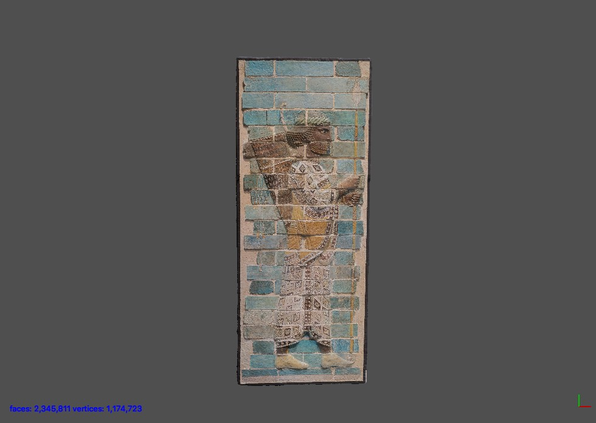

[](http://creativecommons.org/licenses/by-sa/4.0/) 
[](http://orcid.org/0000-0002-0246-2335)

# Lancer from frieze of archers, Louvre Abu Dhabi



This repository contains source data to recreate a 3D model from the British Museum's Assyrian galleries. The file structure is as follows:

```
lancerAbuDhabiLouvre/
├── README.md
├── LICENSE.md
├── Images
├── Masks
├── Other
└── Models
```
Models are included as PLY, OBJ and STL representations. 

# Metadata 

A lancer from the archer’s frieze, from Darius’s palace at Susa. This frieze panel is made from glazed siliceous bricks and dates to the Achaemenid Empire circa 510 BC.

Achéménide Reigne - Lancier, détail de la frise des archers du palais de Darius à Suse.

# Paradata

This model was shot using a Sony A6000 in artificial light during a tour of the new Louvre Abu Dhabi in general opening hours. 44 images were shot as jpegs and RAW. This model was created just from unedited jpegs (as I am lazy.) Masking needs tightening.

# LICENSE
The contents of this repository are licensed under CC-BY-NC to respect the Louvre and their property. I could not find any terms of entry that mentioned 3D models derived from photographs.

# Credits
Photographs and models by Daniel Pett 
